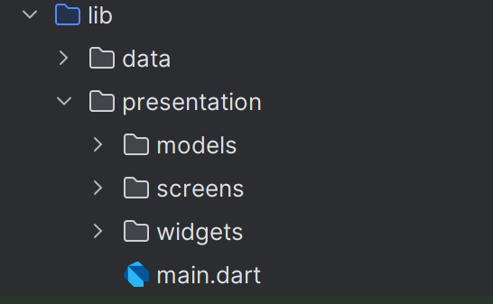
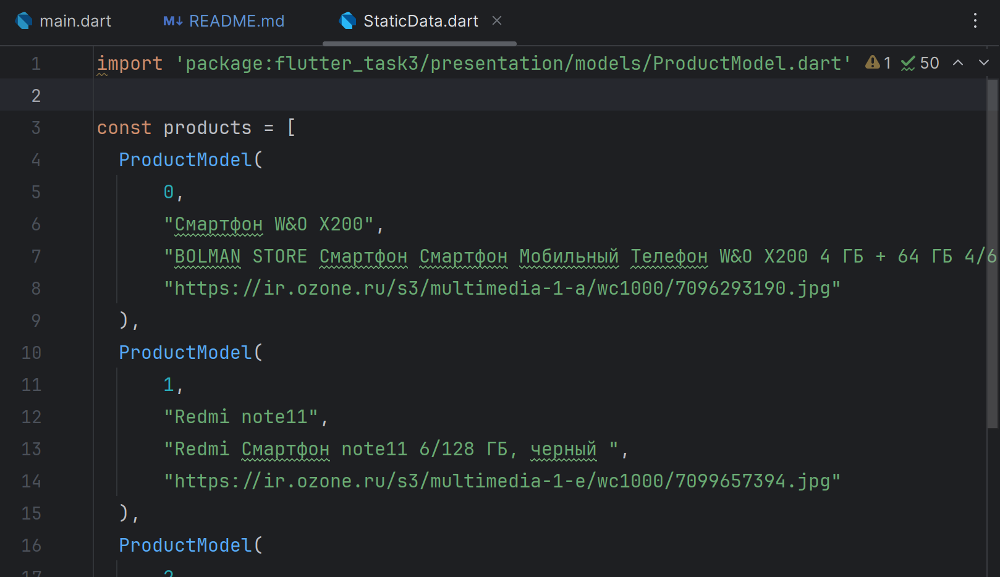
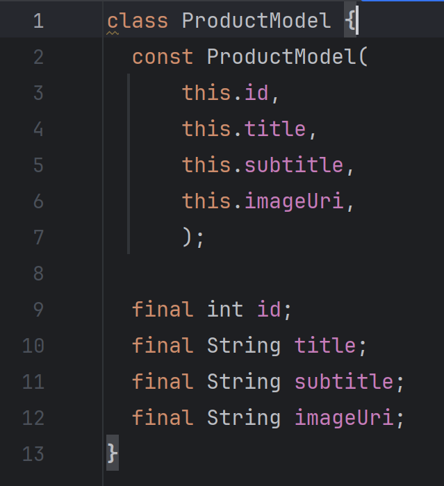
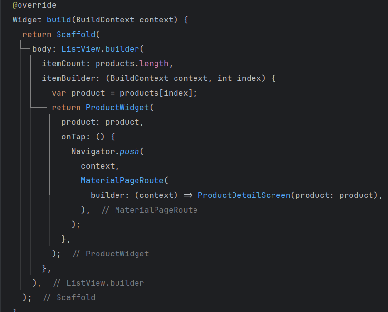
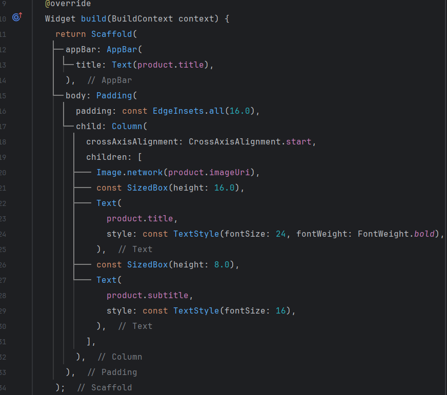

# flutter_task3

ПКС 3 задание
Сейранян Самвел Гагикович, ЭФБО-01-22

- Создал иерархию пакетов

- Проинициализировал список данных

- Написал модель данных

- Сверстал главную страницу!

- Сверстал страницу товара

*Результат*
[Screen_recording_20240922_222126.mp4](..%2F..%2FScreen_recording_20240922_222126.mp4)